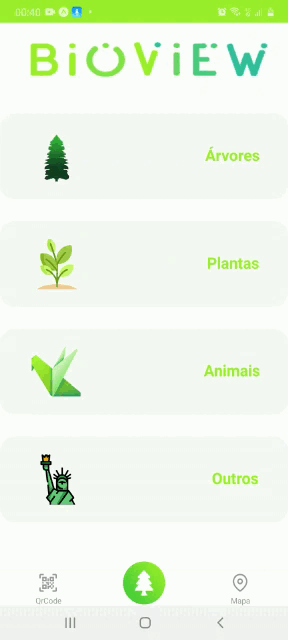

# Bioview

Bioview é um aplicativo voltado para área de Biologia, onde o usuário vai poder escanear QRcode e identificar que diversidade biológica refere-se (Árvores, Plantas, Animais e outros), informando ao usuários as principais informações da diversidade escaneada.

Dentro do aplicativo é possível acessar a câmera para escanear os QRcode e acessar ao mapa para localizar todos QRcode.

<h1>Icon</h1>

  
 
 <h1>Splash</h1>

 

<h1>Gif</h1>

 
  
  <h1>Linguagens</h1>

  
  
  
  
 

